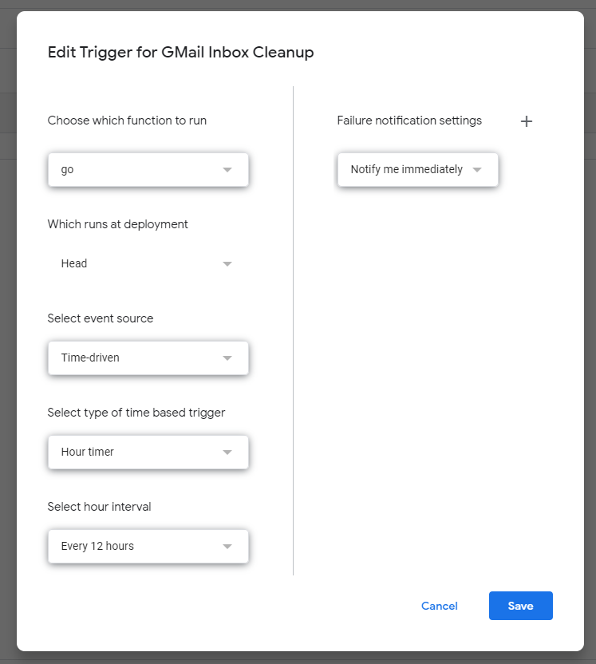

# gmail-inbox-flusher
Automated Inbox Cleanup

Zero inbox sounds cool. But have you ever just spent a day just cleaning up stuff? Sounds counter-intuitive, don't it?

## Philosophy
So the idea here is that the back-breaking work is getting things all labelled up. From there, the script can take over by:
- Auto-populating your super discrete (or not) label heirarchy to gSheets
- Using that auto-populated worksheet of labels as a dropdown to then specify how long to wait until archiving and/or marking as read
- Running and hourly-ish cron (via google apps scripts thingy thingy - go ahead google, keep adding words to this product...)

## How To Use
1. Make a copy of the [gSheet](tinyurl.com/gmail-inbox-flusher-ghseet)
2. Install Clasp & Login
```
npm i @google/clasp -g
clasp login
```
3. Clone me!
4. Set up a Trigger to run it.
Note: Becasue the trigger is the main executor, there is actually **NO NEED TO DEPLOY**

